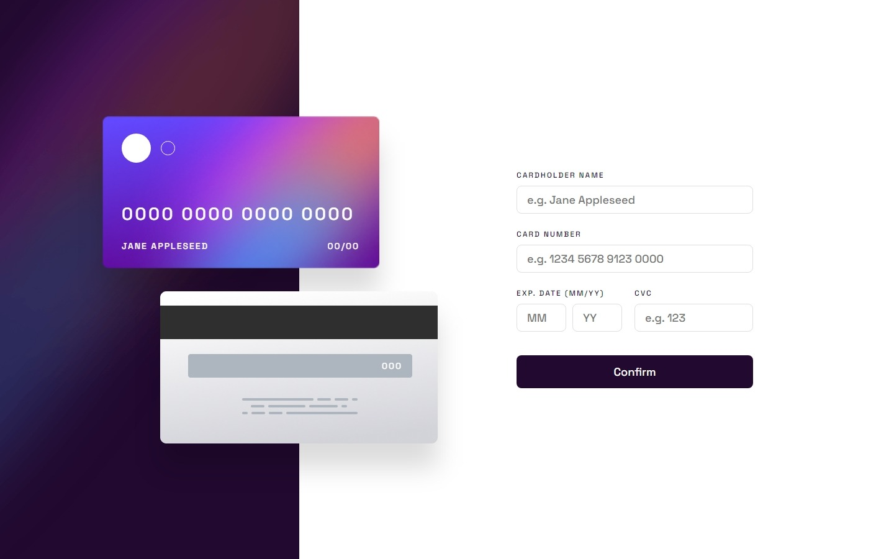

# Frontend Mentor - Interactive card details form solution

Hi everyone 👋

This is a solution to the [Interactive card details form challenge on Frontend Mentor](https://www.frontendmentor.io/challenges/interactive-card-details-form-XpS8cKZDWw) 🎉

## Table of contents

- [Overview](#overview)
  - [The challenge](#the-challenge)
  - [Links](#links)
- [My process](#my-process)
  - [Built with](#built-with)
  - [Difficulties](#difficulties)
- [Author](#author)

## Overview

### The challenge

Users should be able to:

- Fill in the form and see the card details update in real-time
- Receive error messages when the form is submitted if:
  - Any input field is empty
  - The card number, expiry date, or CVC fields are in the wrong format
- View the optimal layout depending on their device's screen size
- See hover, active, and focus states for interactive elements on the page

### Links

- Solution URL: [See source code](https://github.com/ClemFRontend/interactive-card-details-form)
- Live Site URL: [interactive-card-details-form-seven-rose.vercel.app](https://interactive-card-details-form-seven-rose.vercel.app/)

## My process

### Built with

- ⚛️ [React](https://reactjs.org/) - JS library

### Difficulties

This is things that was very difficult to me :
- Validate a form and generate regexes (thks ChatGPT 🤖 for Card name 👀)
- In card Number, insert a space every 4 characters. I don't know if what I did is a good practice but it's working 🤷‍♂️
- The date field was hard to implement. I was forced to create a new component DateInputs to easy to design him
- The background I think was the most difficult to implement for me. Every time your rezise the screen, the behaviour is different and it's very diffcult to control 😥

## Author

- Frontend Mentor - [@ClemFRontend](https://www.frontendmentor.io/profile/ClemFRontend)
